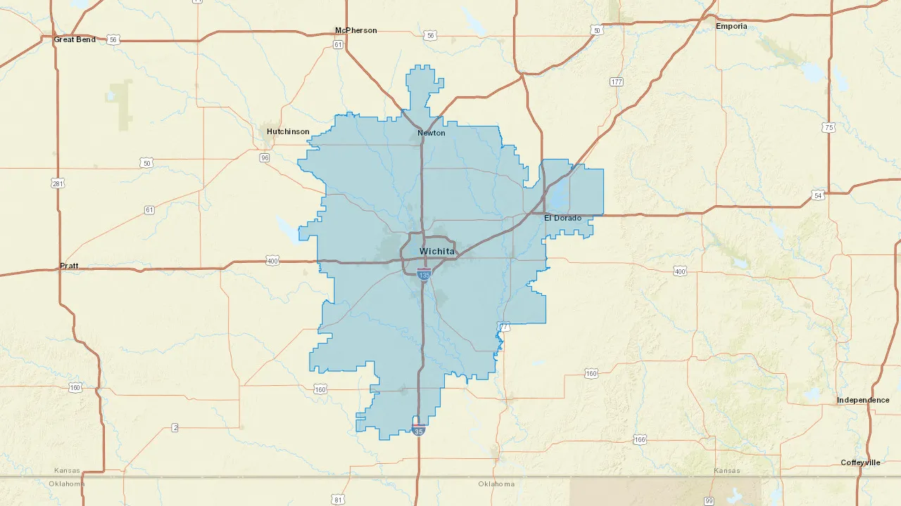

## Deployment

Unzip zcta.tar.xz into the same folder and delete the archive.
Follow the instructions for deployment.

https://learn.microsoft.com/en-us/azure/azure-functions/functions-deployment-technologies

## Basic usage:

### BaseUrl

    {host}/api/static-maps?

### Query Parameters

| Parametr | Type              | Default        | Required |
| -------- | ----------------- | -------------- | -------- |
| color    | HEX               | 0E8BDE         | []       |
| style    | STR               | World_Topo_Map | []       |
| height   | INT               | 600            | []       |
| width    | INT               | 800            | []       |
| zip      | ARRAY[INT] or INT |                | [x]      |
| union    | BOOL              |                | []       |

### Union

| Params | Prev                                         |
| ------ | -------------------------------------------- |
| 1      |      |
| 0      |  |

### Colors

| Params | Prev                                      |
| ------ | ----------------------------------------- |
| 0E8BDE |  |
| fdbb2d |  |

### Styles

| Params                | Prev                                                     |
| --------------------- | -------------------------------------------------------- |
| ESRI_Standard         |          |
| Positron              |               |
| Voyager               |                |
| Waze                  |                   |
| World_Light_Gray_Base |  |
| World_Topo_Map        |         |
